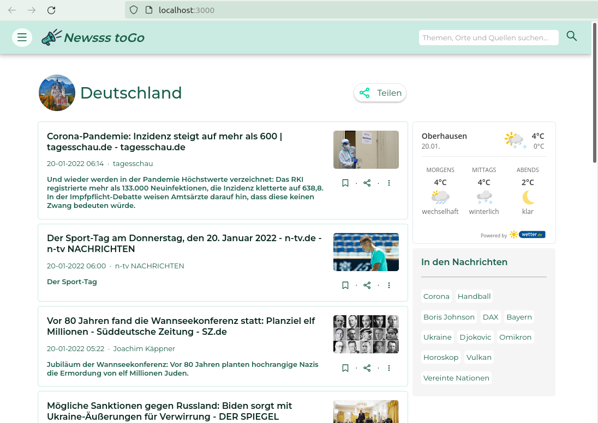

## Newsss toGo

[https://newsss-togo.herokuapp.com/](https://newsss-togo.herokuapp.com/) 

A news application that works with the JSON API from newsapi.org, built with React, JavaScript, and CSS.

  

## Project Status

This project is currently in development. 

  

## Project Screen Shots 

  

  

  

## Installation and Setup Instructions

Clone down this repository. You will need `node` and `npm` installed globally on your machine.  

Installation:

`npm install`  

To Start Server:

`npm start`  

To Visit App:

`localhost:3000/`  

  

## Reflection

This was a 1 week long project built during my React module at DCI. Project goals included using technologies learned up until this point.  

Originally I wanted to build an application that allowed users to pull data from the News API based on what they were interested in. I started this process by using the `create-react-app` boilerplate, then adding `react-icons`, `react-router-dom`, `react-loader-spinner` and `styled-components`.  

<!-- One of the main challenges I ran into was Authentication. This lead me to spend a few days on a research spike into OAuth, Auth0, and two-factor authentication using Firebase or other third parties. Due to project time constraints, I had to table authentication and focus more on data visualization from parts of the API that weren't restricted to authenticated users. -->

The technologies implemented in this project are React, JSX, and CSS. I chose to use the `create-react-app` boilerplate to minimize initial setup and invest more time in diving into weird technological rabbit holes. 

